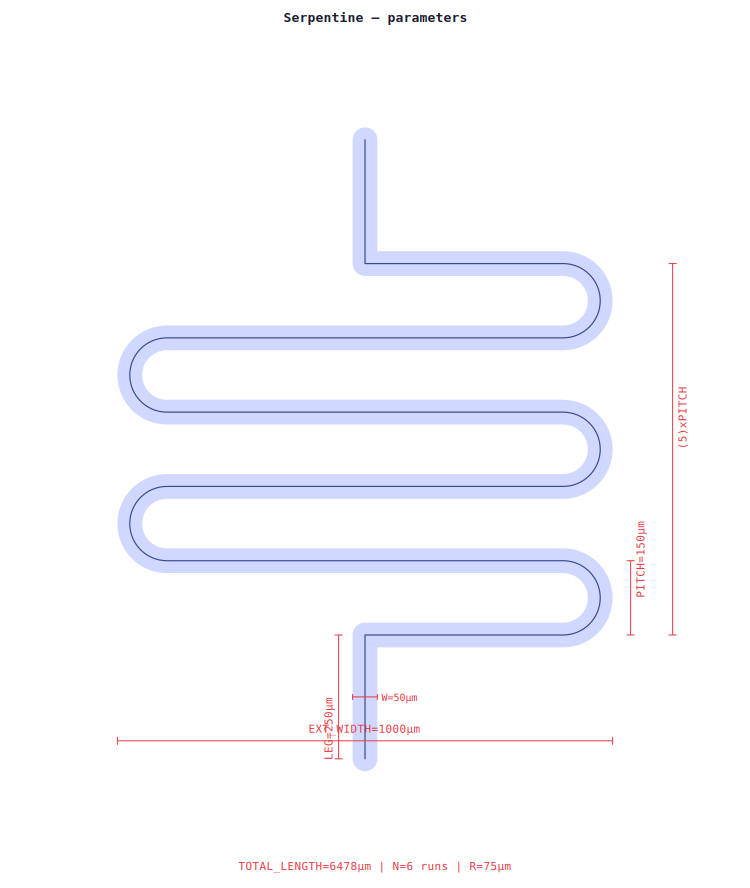
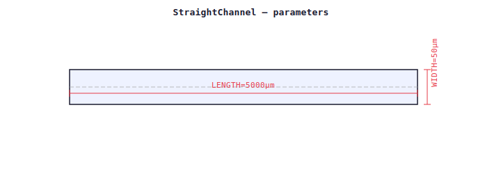
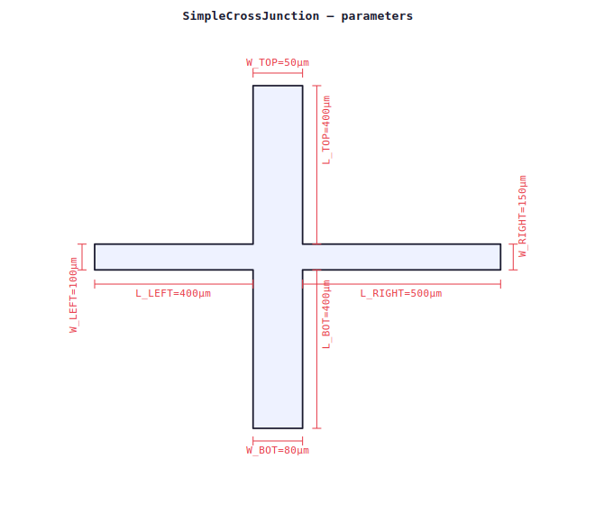
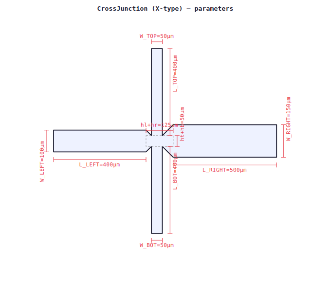
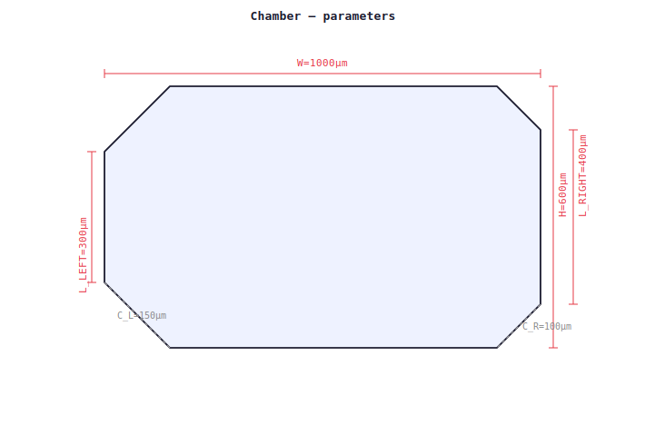
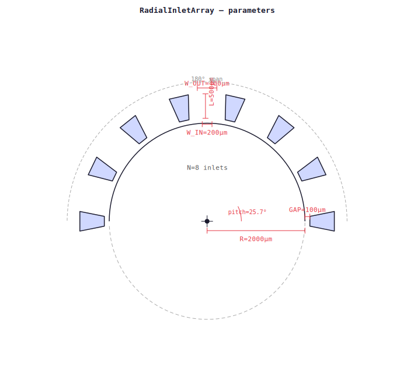
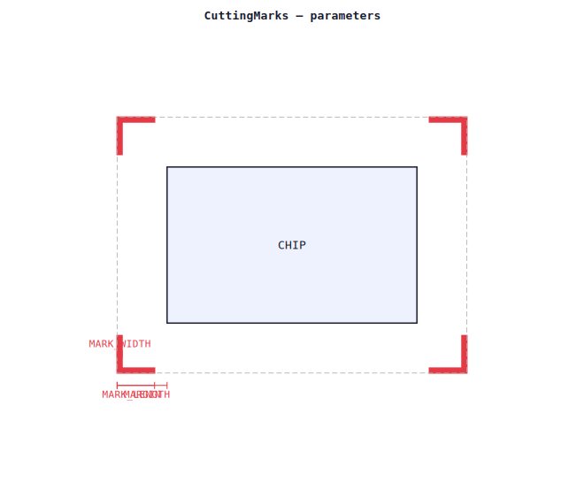

# KLayout Microfluidic Component Library

**Parametric PCells for microfluidic chip design — Institut Pierre-Gilles de Gennes (IPGG)**

A [KLayout](https://www.klayout.de) library of parametric microfluidic components for soft-lithography mask design. All components are implemented as PCells (Parametric Cells) editable directly in the KLayout GUI, with geometry output as `DPolygon` for boolean compatibility.

> **Repo:** https://github.com/FattaccioliLab/klayout-microfluidic-components  
> **License:** CC BY 4.0 — Jacques Fattaccioli, Institut Pierre-Gilles de Gennes / ENS / Sorbonne Université / CNRS

---

## Contents

```
microfluidic-klayout-lib/
├── microfluidic_lib.lym        # Main library — 8 PCells (autoload)
├── cutting_marks.lym           # Cutting marks macro (Tools menu, Shift+C)
├── new_wafer_template.lym      # New layout template (Tools menu, Ctrl+Shift+N)
├── microfluidic.lyp            # Layer colour palette
└── microfluidic_template.py    # Standalone script template
```

---

## Installation

### Requirements

- [KLayout](https://www.klayout.de/build.html) ≥ 0.27  
- No external Python dependencies (uses KLayout's built-in `pya`)

### Steps

1. **Clone or download** this repository:
   ```bash
   git clone https://github.com/FattaccioliLab/klayout-microfluidic-components.git
   ```

2. **Copy the library files** to your KLayout macros folder:

   | OS | Path |
   |---|---|
   | macOS / Linux | `~/.klayout/pymacros/` |
   | Windows | `%APPDATA%\KLayout\pymacros\` |

   Copy **all files** from `MicrofluidicLib_v3/` into that folder:
   ```bash
   cp MicrofluidicLib_v3/* ~/.klayout/pymacros/
   ```

3. **Restart KLayout.** The library auto-registers on startup.

4. **Verify** the library is loaded: open the Library Browser (`View > Library Browser`) and check that **MicrofluidicLib** appears in the list.

---

## Starting a new layout

Run the wafer template macro: **Tools > New microfluidic layout** (or `Ctrl+Shift+N`).

This creates a pre-configured layout with:
- 4" wafer outline + flat (layer `wafer_outline` 99/0)
- 5" square mask footprint — 127 × 127 mm (layer `masque` 20/0)
- Reference outlines to the right of the mask (layer `outlines` 30/0):
  - 60 × 60 mm chip area
  - 15 × 15 mm cover slip
  - 26 × 76 mm glass slide (vertical)
- Layer colour palette (`microfluidic.lyp`) loaded automatically
- Full hierarchy expanded, Library Browser opened on MicrofluidicLib

Your working layer for channel geometry is `PDMS_channel` (1/0).

---

## Components

All components are available in **View > Library Browser > MicrofluidicLib**. Drag and drop onto the canvas, then double-click to edit parameters.

---

### Serpentine Channel

*`SerpentineChannel`*



Centred serpentine with guaranteed inlet/outlet alignment. The solver adjusts total length by at most ~2% to ensure legs sit exactly at `EXT_WIDTH/2`.

| Parameter | Description | Default |
|---|---|---|
| `total_length` | Total centreline length (µm) | 10 000 |
| `channel_width` | Channel width (µm) | 50 |
| `pitch` | Centreline-to-centreline pitch (µm) | 150 |
| `ext_width` | External footprint width (µm) | 1 000 |
| `vertical_leg` | Inlet/outlet leg length (µm) | 250 |
| `n_arc` | Arc segments per 180° turn | 32 |

---

### Straight Channel

*`StraightChannel`*



Simple rectangular channel with arbitrary orientation.

| Parameter | Description | Default |
|---|---|---|
| `length` | Length along centreline (µm) | 1 000 |
| `width` | Channel width (µm) | 50 |
| `angle_deg` | Angle CCW from +x axis (°) | 0 |

---

### T-Junction

*`TJunction`*


Asymmetric T-junction. The three arms are merged into a single polygon via `EdgeProcessor`.

| Parameter | Description | Default |
|---|---|---|
| `w_main` | Main channel width (µm) | 100 |
| `w_top` | Lateral arm width (µm) | 50 |
| `l_left` | Left arm length (µm) | 400 |
| `l_right` | Right arm length (µm) | 500 |
| `l_top` | Top arm length (µm) | 400 |

---

### Y-Channel

*`YChannel`*


Y-junction with independently adjustable inlet angles and widths. Inner walls intersect at an exact chevron tip (no gap, no overlap). Junction centre at origin; flow exits along +x.

| Parameter | Description | Default |
|---|---|---|
| `theta_deg` | Half-angle between inlet arms and horizontal (°) | 30 |
| `w_upper` | Upper inlet width (µm) | 80 |
| `w_lower` | Lower inlet width (µm) | 80 |
| `w_outlet` | Outlet width (µm) | 150 |
| `l_upper` | Upper inlet length (µm) | 400 |
| `l_lower` | Lower inlet length (µm) | 400 |
| `l_outlet` | Outlet length (µm) | 500 |

---

### Flow-Focusing Junction (simple)

*`FFSimpleJunction`*



Simple cross-junction (4 rectangular arms, merged). All four arm widths and lengths are independent. Suitable for flow-focusing with symmetric sheath arms.

| Parameter | Description | Default |
|---|---|---|
| `w_top` / `w_bottom` | Dispersed-phase arm widths (µm) | 50 |
| `w_left` / `w_right` | Continuous-phase arm widths (µm) | 200 |
| `l_top` / `l_bottom` / `l_left` / `l_right` | Arm lengths (µm) | 400 |

---

### Flow-Focusing X-Junction

*`FFXJunction`*



X-junction with re-entrant orifice geometry. The central rectangle is constrained by the *crossing* arm widths (not by the arm's own width), which correctly models the pinch-off geometry of a flow-focusing device.

| Parameter | Description | Default |
|---|---|---|
| `w_top` / `w_bottom` | Dispersed-phase arm widths (µm) | 50 |
| `w_left` | Continuous-phase inlet width (µm) | 100 |
| `w_right` | Outlet width (µm) | 150 |
| `l_top` / `l_bottom` / `l_left` / `l_right` | Arm lengths (µm) | 400 / 400 / 1000 / 400 |

---

### Chamber

*`Chamber`*



Rectangular chamber with independent chamfers on left and right ends, defined by the length of the non-chamfered vertical edge (`l_left`, `l_right`). Setting `l_left = l_right = height` gives a plain rectangle.

| Parameter | Description | Default |
|---|---|---|
| `width` | Total width (µm) | 2 000 |
| `height` | Total height (µm) | 600 |
| `l_left` | Left vertical edge length (µm) | 200 |
| `l_right` | Right vertical edge length (µm) | 200 |

---

### Outlet (radial inlet array)

*`Outlet`*



Circular reservoir with an array of trapezoidal punching guides distributed over a configurable angular span.

| Parameter | Description | Default |
|---|---|---|
| `radius` | Circle radius (µm) | 500 |
| `n_inlets` | Number of trapezoids | 8 |
| `angle_start` / `angle_end` | Angular span (°) | 0 / 180 |
| `w_inner` / `w_outer` | Trapezoid inner/outer width (µm) | 200 / 400 |
| `l_trap` | Trapezoid radial length (µm) | 500 |
| `gap` | Radial gap between circle and trapezoid (µm) | 100 |

---

## Cutting Marks macro

The cutting marks macro inserts L-shaped corner marks for dicing. It is a standalone macro, not a PCell, because its geometry depends on the bounding box of existing shapes.

**Run it:** Tools menu → *Cutting Marks* (or `Shift+C`)

**Behaviour:**
- If objects are selected, marks are placed around their combined bounding box.
- If nothing is selected, the full cell bounding box is used.

**Parameters** (edit at the top of `cutting_marks.lym`):

| Parameter | Description | Default |
|---|---|---|
| `MARGIN` | Distance from chip bbox to corner (µm) | 2 000 |
| `MARK_LENGTH` | Arm length of the L (µm) | 500 |
| `MARK_WIDTH` | Line width of the L (µm) | 50 |
| `LAYER_INFO` | Output layer | 10/0 |



---

## File format notes

- All geometry is output as `DPolygon` (integer polygon after `to_itype(dbu)`), compatible with boolean operations via `EdgeProcessor`.
- Default DBU is `0.001` µm (1 nm resolution).
- The serpentine uses `DPath.polygon()` for arc-to-polygon conversion with flat endcaps (`bgn_ext = end_ext = 0`).

---

## Todo / known limitations

- [ ] **Rounded corners** — optional fillet radius on channel junctions (reduces stress concentration in PDMS)
- [ ] **Connector ports** — named snap points at each arm end for automated chip assembly
- [ ] **Y-channel with divider wall** — variant with a central wall separating the two inlet streams into the outlet
- [ ] **Meander resistor** — compact resistance channel with configurable number of turns and turn geometry
- [ ] **Via / inlet pad** — circular pad with optional reservoir ring, suitable for punching guides
- [ ] **Salt package** — publish to KLayout's built-in package manager for one-click install
- [ ] **GDS test file** — reference layout with one instance of every component at default parameters
- [ ] **DXF export workflow** — documented procedure for sending to clean-room mask writers

---

## Citation

If you use this library in published work, please cite:

> J. Fattaccioli, *KLayout Microfluidic Component Library*, Institut Pierre-Gilles de Gennes, 2025.  
> https://github.com/FattaccioliLab/klayout-microfluidic-components — CC BY 4.0